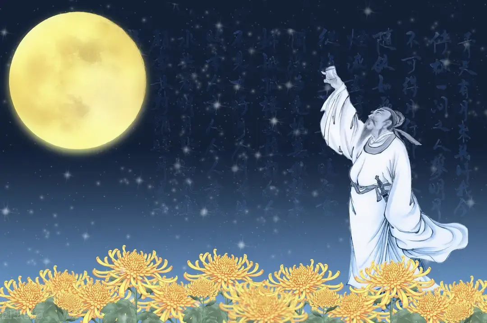

# 《将进酒》原文翻译赏析-李白古诗

[原文链接](http://www.chinayantai.net/libai/10115.html "《将进酒》原文翻译赏析-李白古诗")

[b站链接](https://www.bilibili.com/video/BV1cP411Y7gN "《将进酒》完整版")

君不见黄河之水天上来，奔流到海不复回。

君不见高堂明镜悲白发，朝如青丝暮成雪。

人生得意须尽欢，莫使金樽空对月。

天生我材必有用，千金散尽还复来。

烹羊宰牛且为乐，会须一饮三百杯。

岑夫子，丹丘生 ，将进酒，杯莫停。

与君歌一曲，请君为我倾耳听。

钟鼓馔玉不足贵 ，但愿长醉不愿醒。

古来圣贤皆寂寞，惟有饮者留其名。

陈王昔时宴平乐 ，斗酒十千恣欢谑。

主人何为言少钱，径须沽取对君酌。

五花马 ，千金裘，呼儿将出换美酒，与尔同销万古愁。

### 注释

①岑夫子，丹丘生：李白友人岑徵君、元丹丘。岑、元曾招李白相聚，李白有《[酬岑勋见寻就元丹丘对酒相待以诗见](http://www.chinayantai.net/libai/shiwen/53.html)招》诗纪实。

②钟鼓馔（zhuàn）玉：钟鼓，富贵人家宴会中奏乐使用的乐器。馔玉，形容食物如玉一样精美。

③陈王：指陈思王曹植。

④五花马：马之毛色作五花文。

### 【诗人名片】

李白（约701～762），祖籍陇西成纪（今甘肃天水），字太白，号青莲居士，自认为与唐朝皇室同宗。隋朝末年随先祖流落西域，生于中亚碎叶。五岁时，父亲将其带到蜀地，年少时在蜀地求学。他二十五岁时离开蜀地漫游，结交朋友，干谒社会名流。这期间曾去长安求官，却没有成功。天宝初年，通过玉真公主的推荐，被诏入京，担任翰林。但不久便因遭诬陷而离开京城，四处漂泊。安史之乱后，他做了永王的幕僚。后来永王因反叛被肃宗所杀，李白受到牵连，被流放到夜郎。虽中途获得赦免，但不久就因病去世了。

### 【将进酒译文1】

你没有看见，黄河之水从天上流下来，奔流到大海不再回。你没有看到厅堂的明镜中，我又生了白发，清晨发如青丝，傍晚便如白雪一般。人生得意时刻尽情欢乐，不要让酒杯空对明月。上天生下我为栋梁之材终究会发挥作用，千金用尽了还会再来。烹羊宰牛吧，让我们尽情地欢乐，应该整整地喝上三百杯。岑夫子、丹丘生，请喝酒，莫停杯。我为你们唱一曲，请你们特别认真听。荣华富贵不必在意，只愿长久地陶醉酒中不要清醒。自古以来圣贤之人身后默默无闻，只有饮者留下千古美名。从前陈王在平乐观摆设盛宴，一斗美酒值一万钱，他们借助酒兴尽情地欢娱戏谑。主人为什么说缺少钱，应该毫不犹豫地买来美酒我们对着喝。名贵的五花马，价值千金的狐皮袍，叫侍童拿出去换美酒，我和你一起忘却那万古的愁绪。

### 【将进酒译文2】

你不见黄河的水流从天上来，滚滚流向大海不再回还。你不见面对高堂明镜悲伤白发，早晨如青丝晚上变得雪白。人生得意时应当尽情欢乐，不要让酒杯空着对明月。老天给我们才能定有用，千金散尽还能再回来。杀牛烹羊暂且欢乐快活，应该一饮就喝它三百杯。岑夫子啊，丹丘生，请喝酒，莫要停下来。让我为你们唱支歌，请你们为我倾耳听。山珍海味的生活并不值得炫耀，只愿意长醉不愿意清醒。自古以来圣贤都冷落寂寞，只有饮酒的高士留下美名。陈王曹植过去设宴平乐宫，豪饮千杯玩得特别尽兴。主人怎么能够说你的钱少，只管买酒来咱们一起痛喝。什么五花良马千金的狐裘，快叫孩子拿出去换取美酒，我和你们一同消除万古忧愁。

### 【将进酒译文3】

你难道没有看见，黄河之水从天上倾泻而来，波涛滚滚直奔东海不回还。你难道没有看见，在高堂上面对明镜悲叹白发，早上还是满头青丝，晚上就变得发白如雪。人生得意之时应纵情欢乐，切不要让金杯空对皎洁的明月。天造就了我栋梁之材，定会有大用，即使散尽了千两黄金，也会重新得到。烹羊宰牛姑且尽情欢乐，一次痛饮三百杯也不嫌多！岑夫子呀，丹丘生，请快喝啊，杯莫停。我为你们高歌一曲，请你们侧耳细细听。钟鸣鼎食的豪华生活不值得珍贵，我愿永远沉醉，不再清醒。自古以来圣人贤者都被冷落寂寞，只有那善饮的人才能留下美名。陈王曹植当年曾在平乐观大摆酒宴，一斗酒值千金仍然尽情欢笑。主人你别担心给钱少，你只管端出酒来让我陪着朋友喝。牵来名贵的五花马，取出价值千金的狐皮裘，快叫侍儿拿去换美酒，让我们共举杯来消融这万古长愁。

### 【将进酒赏析1】

《将进酒》题目的意思为“劝酒歌”，是借古题“填之以申己意”。该诗是汉[乐府](http://www.chinayantai.net/libai/index-15.htm)短箫饶歌二十二曲之一，多数写的是饮酒高歌的事。该诗是李白遭到诽谤离开长安后写的，时间大概是天宝十一年（752）。当时诗人正和朋友岑勋在嵩山颍阳隐居的好友元丹丘家做客，三人经常登山宴饮。借助酒兴和诗意，诗人的满心幽怨一吐而出。

该诗以颇有气势的排比句开始。上句写大河的来势不可阻挡，大河的去势不可回转。一来一回，有很强烈的反复咏叹的味道。下句将从年少到年老的人生过程比喻成“朝”“暮”之间的事，感叹人生的短暂。上句从空间的角度进行夸张，下句从时间的角度进行夸张。

但下面两句却一转悲凉的情调，变得欢快起来：从“人生得意”到“杯莫停”，诗人的情绪渐渐高昂起来。诗人认为应该尽情欢乐，只要“人生得意”，生命便没有遗憾。行乐必须有酒，该句用“金樽”、“对月”，虽没有写酒，却将饮酒诗意化。虽然没有写如何痛饮，但“莫使金樽空对月”中的双重否定词，却使诗意更浓。诗人主张及时行乐，但并不是沉沦，他坚信“天生我材必有用”，“千金散尽还复来”。接着，诗人描写了一场盛大的宴席。大家都整头地“烹羊宰牛”，非要喝个“三百杯”才罢休。“岑夫子，丹丘生，将进酒，杯莫停”一组短句，在让人如闻诗人的劝酒高声之时，也使诗歌的节奏在此有了一些变化。

“与君歌一曲，请君为我倾耳听”描写了酒逢知己之时，诗人要对朋友高歌的情形。之后的八句就是诗人的歌中内容。在诗人看来，“钟鼓馔玉不足贵”，他还想“但愿长醉不复醒”。到此，诗人开始酒后吐真言，情绪也从豪放转到激愤。下面两句好像诗人在进行自我安慰，其实是通过说古人“寂寞”来说自身的“寂寞”。所以，他宁愿长醉不醒。接下来，诗人将“陈王”曹植作为“留其名”的“饮者”代表。虽然曹植的例子看似和政治无关，但其实包含着诗人心中十分沉重的忧愤。

刚刚袒露完心情，诗人又开始说酒，并且情绪越来越狂妄。诗歌主人公慷慨地挥洒千金，甚至用五花马、千金裘来换美酒，且“呼儿”的语气十分之大。这里，诗人“不可一世”的神态，不仅表现出了他的“醉意”，也让读者看到了他率真的个性和与朋友深厚的友情。之后一句“与尔同销万古愁”，在意犹未尽的诗情中又凸现诗人感情的奔流激荡。

该诗堪称千古佳作，起伏跌宕，非大手笔无法成就。

### 【将进酒赏析2】

《将进酒》本是汉乐府的曲调之一，为劝酒而唱的歌辞。李白当时胸中积郁很深，自己的政治抱负既不能施展，岁月又很容易流逝，因此此诗突兀而来的是这样一种叹息：“黄河之水天上来，奔流到海不复回”，人生亦如之，岁月匆匆易过，悲愁能令人迅速衰老。既然人生在世不得意，那么就不如酩酊一醉，忘却烦忧。这是一句牢骚悲愤语，但李白不是沉浸在悲愤中不能自拔的人，他立即又发出了“天生我材必有用，千金散尽还复来”这乐观自信的宣言。这是诗歌的第一段。诗的以下部分，李白劝朋友多饮酒，在酒中寻找快乐、寄托情怀：钟鸣鼎食的富贵不足以羡慕，我们只愿长醉不愿醒！自古及今，只有善饮之人留名于后世，陈思王曹植不就是一个例子吗？不要说没有沽酒钱，把五花马、千金裘统统拿出来去换了钱沽酒来饮吧！我与你们一醉方休，忘却那无边无际的深愁吧！一个“愁”字如同鬼魂那样在诗中出没。这愁，正是李白政治上不遇的忧愁；这愁，可以借酒浇之，但醉时苦短醒时苦长。虽说“天生我材必有用”，但毕竟现在仍需借酩酊一醉来“与尔同销万古愁”啊！

这是李白著名的咏酒诗篇，传诵千古。诗人仕途失意后，以纵酒狂欢来消释内心的苦闷。诗的发端采用比兴手法，黄河之水如挟天风海雨向读者迎面扑来。诗的主旨是主张及时行乐，轻视功名富贵但同时高唱“天生我材必有用”，骨子里却是那抹不掉的自信。全诗笔酣墨饱，气势奔放，音调高亢，一气呵成，情极悲愤而狂放，语极豪纵而沉着，具有震古铄今的气势与力量。

### 【将进酒赏析3】

这首诗主观感情色彩很强，有两个主要艺术特色——一是夸张手法的运用，二是内在韵律的大起大落。“将”（qiāng），意思是劝，“将进酒”的意思就是“劝酒歌”。创作背景有两种说法，一说作于天宝十一年（752）即诗人二入长安后，一说作于开元二十四年（736）即诗人一入长安后。目前，学术界普遍倾向于第二种说法。原因是：李白一入长安虽没有找到政治出路，但对政治仍抱有很大幻想，因此，在一入长安之后、二入长安之前的诗，牢骚与期望并存。在二入长安之后，李白对政治几乎完全失望，诗中对现实持否定态度。《将进酒》所表现的思想内容，既有“古来圣贤皆寂寞，惟有饮者留其名”的牢骚，又有“天生我材必有用”的期望，符合一入长安之后、二入长安之前的诗人心态。

黄河的景象本来就是壮阔的，水流湍急，落差很大，但源头再高，也高不到天上去呀。“黄河之水天上来”把本来壮阔的说得更壮阔，这是放大式的夸张。这个夸张有一层比喻的意义，就是时间的一去不复返，但主要还是赞美河山的壮丽，这与李白的政治抱负是紧密联系着的。“高堂”是古代四合院的正堂，古人也用它来代称父母，但在这首诗中却是居家的意思，人生苦短，少年时一头青青的黑发，不知道什么时候就换成了白发。人的头发由黑变白，本来有一个时间过程，起码有一个“二毛”的阶段，但诗人取消了这个过程，把人生的由少到老，说成是一“朝”一“暮”的事。把一个短暂的事情，说得更加短暂，这就是缩小，这也是一种夸张，只不过是反向的夸张，其作用仍是增强表达效果，目的是感慨人生渺小。

可以说，没有夸张就没有李白。扩大式夸张在李白还有一种特殊形态，就是“数字化夸张”，就是运用大数目字以达到夸张的目的。这种夸张形式在《将进酒》有比较集中的运用，如“会须一饮三百杯”“千金散尽还复来”“斗酒十千恣欢谑”“五花马，千金裘”“与尔同销万古愁”等等，或夸张饮酒之多、或夸张花销之巨、或夸张时间之长，等等。《水浒传》写武松过景阳冈，酒旗上写着“三碗不过冈”，而武松一口气喝下了十八碗，这也很夸张。但比起《将进酒》的“会须一饮三百杯”，似乎又算不得什么了，这里的效果是更加豪放、更加淋漓尽致、更加富有诗意。

李白在写作这首诗时的处境，一方面是遭遇政治失意，是冷酷的社会现实；另一方面是他一向怀有的政治抱负，是建功立业的崇高理想。这就构成了作者的思想矛盾和冲突——这就是诗情大起大落的深层次原因。

[李白诗歌](http://www.chinayantai.net/libai/index.htm)内在韵律上的特点是大起大落。在《将进酒》中可以简单概括为一起一落，再起再落，再起。诗开篇是两组长句，一组长句把黄河的壮丽说得更加壮丽，面对壮丽河山，诗人豪情满怀，欲有作为。这是诗情的一次大起。紧接着，另一组长句把短暂的生命说得更加短暂，表现出诗人因仕途不顺而产生的时不我待，对虚度年华的恐惧。这是诗情的一次大落。

然而，诗人拒绝消沉。于是诗情再起：“人生得意须尽欢，莫使金樽空对月。”这里说的人生得意，当然不是现实，而是未来，诗人肯定有这样的未来，所以他要为未来痛饮满杯。“天生我材必有用”表达的是使命感、是自信——“有用”而“必”！不但自信，而且充分。“千金散尽还复来”，仍然是自信——这不仅仅是说花钱的豪爽，更是对“钱”景的乐观。“烹羊宰牛且为乐”以下几句，则是为想象中乐观的前景而安排的一场盛宴，作者用夸张的手法铺叙了这场盛宴，绝不同于“菜要一碟乎两碟乎，酒要一壶乎两壶乎”（《镜花缘》），而是整头整头地“烹羊宰牛”，不喝上“三百杯”决不罢休。他写了席间的劝酒之声：“岑夫子，丹丘生，将进酒，杯莫停！”这就是诗情的第二次大起。

接着，“请君为我倾耳听”以下，作者唱了一首诗中之歌。歌中唱道“但愿长醉不复醒”，这是对现实不满，是牢骚，也是诗情的再次低落。“古来圣贤皆寂寞，惟有饮者留其名”，这是继续发牢骚，情绪相当主观。读者完全可以提出质疑，举出许多反例，来证明它的不成立。却并不妨碍诗人用这样具有强烈主观情绪的诗句，来表达他对现实的不满。对古代著名的“饮者”，作者举出了一个三国时魏国的陈思王曹植，因为他怀才不遇，壮志难酬，所以借酒消愁，诗人就这样借古人的酒杯，浇自己的块垒。这是诗情的第二次大落。

“主人何为言少钱，径须沽取对君酌”以下诗情再转狂放，甚至说“五花马，千金裘，呼儿将出换美酒，与尔同销万古愁！”这里是回应前文“人生得意须尽欢，莫使金樽空对月。天生我材必有用，千金散尽还复来”。并不因为现实的不得意，而否定未来，为了作者肯定会到来的明天和未来，他要痛饮高歌，把过去一切的不愉快——“万古愁”（指从古以来由人生苦短引起的悲愁）彻底“销”掉。用今天的话来说，就是永久性删除。这是诗情的第三次大起，也是全诗的结束。

诗情的大起大落和强烈的主观感情色彩，以及由此形成的强烈的冲击力和感染力，是[李白诗](http://www.chinayantai.net/libai/libai15591.html)歌的突出艺术特点。通过这样的艺术表现，读者从诗中感受到的是个性的极度张扬，是对现实不满情绪的发泄，是对理想和未来的执著。这样的思想内容，为什么要通过劝酒的方式来表现呢？这是因为酒能使人情绪亢奋、酒能使人无拘无束、酒能使人缓解压力、酒能使人放言无忌，借“将进酒”这种形式，能使诗中的政治抒情既酣畅淋漓，又含蓄不露。说它含蓄不露，是因为诗中并没有直接批评现实政治。

因此，不能简单地把《将进酒》理解成一首提倡饮酒的诗，而应该看到在“借酒浇愁”的表面下，这首诗所包含的正面的积极的思想内容，那就是：不必为人生短暂而忧伤，不必为人生挫折而烦恼，应当相信未来、相信明天、相信自己——“天生我材必有用”！换言之，永远拒绝负面情绪，永远给自己以积极的心理暗示——这才是这首诗给读者的人生启迪。

（周啸天）

### 【将进酒赏析4】

《将进酒》题目的意思为“劝酒歌”，是汉乐府短箫饶歌旧题，多数写的是饮酒高歌之事，李白在此借古题“填之以申己意”。这首诗旧说是李白遭到诽谤离开长安后写的，时间大概是天宝十一年（752年）。后经今人考证，应该是开元间李白第一次到长安时所作。当时李白正和友人岑勋在嵩山颍阳隐居的好友元丹丘家做客，三人经常登山宴饮。借助酒兴和诗意，李白以奔放的激情表现了自己蔑视世俗，不愿与世俗同流合污的高昂气概和对“天生我才必有用”的坚定信念。

本诗以颇有气势的排比句开始。上句写大河的来势不可阻挡，去势不可回转。一来一回，有强烈的反复咏叹的味道。下句悲叹人生短促，但诗人在写法上别出心裁，用一句“高堂明镜悲白发”勾勒出一种搔首顾影、徒呼奈何的情态，从而感叹时光易逝。另外，诗人将从年少到年老的人生过程比喻成“朝”“暮”之间的事，以此感叹人生的短暂。上句从空间的角度进行夸张，而下句则从时间的角度进行夸张。纵观开篇的这组排比长句，既有比意，又有反衬。具体而言，以河水一去不复返比喻人生匆匆易逝，此为比意；以黄河的永恒奔腾衬托人生命的脆弱，此为反衬。从写作笔法上看，这个开篇虽悲壮，却具有震慑心魄的艺术力量。

但下面两句却一转悲凉的情调，变得欢快起来：从“人生得意”到“杯莫停”，诗人的情绪渐渐高昂起来，诗情逐渐变得豪放洒脱。诗人认为应该尽情欢乐，生命才没有遗憾。而行乐必须有酒。该句的“金樽”、“对月”虽没有直接写酒，却将饮酒诗意化。虽然没有写如何痛饮，但“莫使金樽空对月”中的双重否定词，却使诗意更浓。从“人生得意须尽欢”一句，读者可以看出，诗人似乎主张及时行乐，但这并不代表诗人主张沉沦，他坚信“天生我材必有用”，“千金散尽还复来”。这两句诗透出了诗人乐观、自信的品格。接下来，诗人描写了一场盛大的宴席。大家都整头地“烹羊宰牛”，非要喝个“三百杯”才罢休。而下面“岑夫子，丹丘生，将进酒，杯莫停”的一组短句，让人如闻诗人劝酒高声的同时，也使诗歌的节奏起了变化，生动别致。

“与君歌一曲，请君为我倾耳听”描写了酒逢知己之时，诗人要对友人高歌的情形。之后的八句就是诗人的歌中内容。在诗人看来，“钟鼓馔玉何足贵”，他还想“但愿长醉不复醒”。到此，诗人开始酒后吐真言，情绪也从豪放转到激愤。下面两句好像诗人在进行自我安慰，其实是通过说古人“寂寞”来说自身的“寂寞”。所以，他宁愿长醉不醒。接下来，诗人将“陈王”曹植作为“留其名”的“饮者”代表。虽然曹植的例子看似和政治无关，但其实包含着诗人内心因政治上受挫而产生的沉重忧愤。

刚刚袒露完心情，诗人又开始说酒，并且越来越狂妄，不仅要慷慨地散尽“千金”，甚至还要用“五花马”、“千金裘”来换美酒，且“呼儿”的语气十分之大。这里，诗人“不可一世”的情态，不仅表现出了他的“醉意”，也让读者看到了他真率的个性及与友人深厚的友情。之后一句“与尔同销万古愁”，在意犹未尽的诗情中又凸现诗人情感的奔流激荡。

本诗堪称千古佳作，起伏跌宕，非大手笔无法成就。
